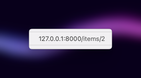
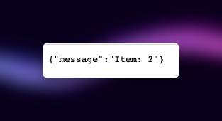
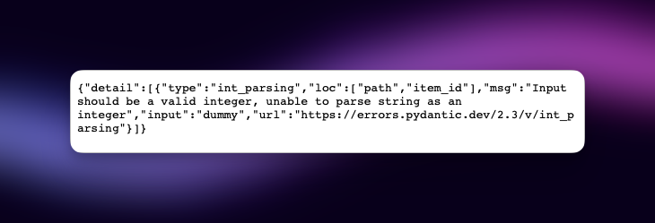
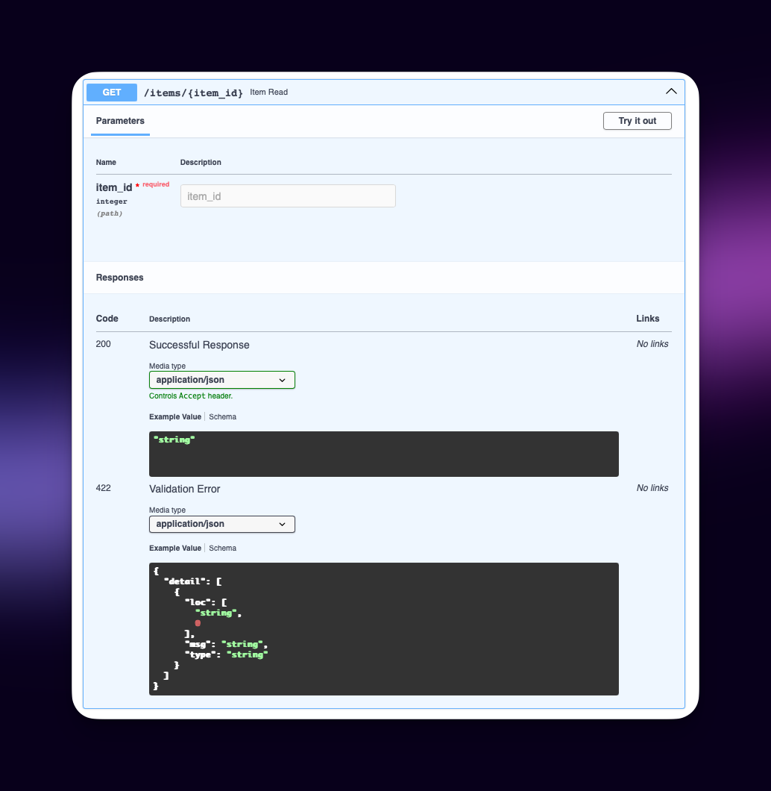
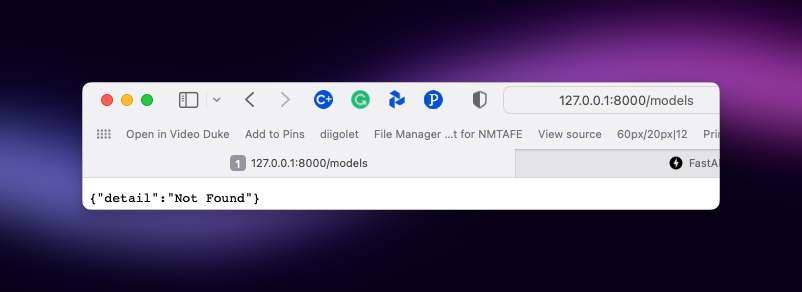
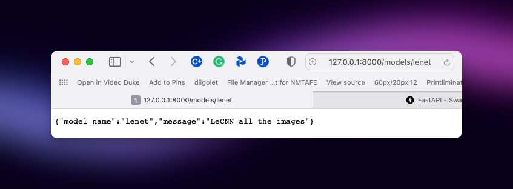
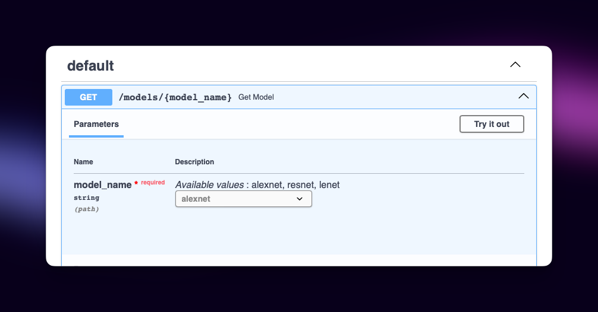

# Endpoints and Parameters

Endpoint parameters are part of the "path" that you define.

For example:

```python
from fastapi import FastAPI

app = FastAPI()


@app.get("/items/{item_id}")
async def read_item(item_id):
    return {"item_id": item_id}
```

The value of the parameter `item_id` is passed into the `read_item` method via the `item_id` method argument.

So if we call the above using `http://127.0.0.1:8000/items/1234` then the `item_id` would be `1234`. Likewise, if we called the API using `http://127.0.0.1:8000/items/brickheadz-40354` then the vlue of `item_id` would be the string `brickheadz-40354`.

We can go one step better by adding type hinting or type annotations:

```python
from fastapi import FastAPI

app = FastAPI()


@app.get("/items/{item_id}")
async def read_item(item_id: int):
    return {"item_id": item_id}
```

This will now expect an integer and provide type conversion when possible.

With integer value in endpoint:






With string value in endpoint:




The API Docs for the new endpoint are shown below:




## Data Validation by Pydantic

All the data validation is performed under the hood by [Pydantic](https://pydantic-docs.helpmanual.io/), so you get all the benefits from it. And you know you are in good hands.

You can use the same type declarations with str, float, bool and many other complex data types.


## Endpoint Gotchas!

One thing to remember is that the order of endpoint definitions (just like Routes in Laravel).

If you have an endpoint such as `/users/me` it must be defined BEFORE the endpoint such as `/users/{user_id}`. That is:

```python
from fastapi import FastAPI

app = FastAPI()


@app.get("/users/me")
async def read_user_me():
    return {"user_id": "the current user"}


@app.get("/users/{user_id}")
async def read_user(user_id: str):
    return {"user_id": user_id}
```

This is because the endpoint `/users/{user_id}` would match `/users/me` by putting the "me" into the variable `item_id`.

Also, you cannot redefine the same endpoint, as illustrated below, because the first endpoint would ALWAYS be matched.


```python
from fastapi import FastAPI

app = FastAPI()


@app.get("/users")
async def read_users():
    return ["Rick", "Morty"]


@app.get("/users")
async def read_users2():
    return ["Bean", "Elfo"]
```


## Predefined Values and Enums

If you want to have an endpoint operation that has a path parameter, but you wish to limit the possible options, then use an enumerated type (Enum).

Do this by defining an Enum class, then using this class as the 'type hint' for the endpoint, as part of the endpoint method parameters.

Here is an example:

```python
from enum import Enum

from fastapi import FastAPI


class ModelName(str, Enum):
    alexnet = "alexnet"
    resnet = "resnet"
    lenet = "lenet"


app = FastAPI()


@app.get("/models/{model_name}")
async def get_model(model_name: ModelName):
    if model_name is ModelName.alexnet:
        return {"model_name": model_name, "message": "Deep Learning FTW!"}

    if model_name.value == "lenet":
        return {"model_name": model_name, "message": "LeCNN all the images"}

    return {"model_name": model_name, "message": "Have some residuals"}
```

Here are some example results, and see how the documentation now shows the possible options:








More on this at [https://fastapi.tiangolo.com/tutorial/path-params/](https://fastapi.tiangolo.com/tutorial/path-params/).

## Up next...

We now look into [Query Parameters](Query-Parameters.md).
